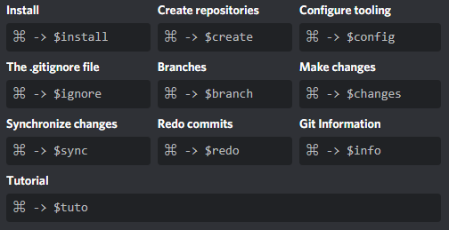

# F

> Previously flanker-discordbot

  

F is the non experimental version of the original ["flanker"](https://github.com/rodzy/flanker-discordbot) the discord bot for git commands and info about the version control system

## Connect to discord

[Get Flanker here!](https://discord.com/oauth2/authorize?client_id=703454326722396161&permissions=519232&scope=bot)

## Type `$help`

`$help` will trigger the set with all the available commands

## License

> F/Flanker is licensed under the MIT License, and mantained by [@rodzy](https://twitter.com/rodzyrm)
